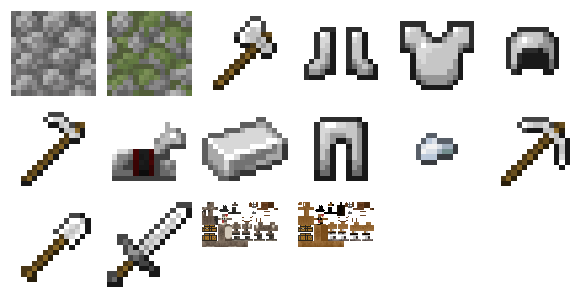

# Git Thumbnail (Discord Bot)

This open-source utility scans through local Git repositories to find recently added images in `png` and `tga` formats, 
generating thumbnail collages for each **git author** and **repository** combination. These collages are then 
automatically posted to a specified **Discord channel**, providing an easy way to visually track & share new 
image assets across multiple projects.

## Pixel Art & Team Collaboration

**Transform your team's art review process!** Instantly share and discuss new textures, UI designs, 
and game assets in **Discord** with automatically generated collages. Engage with reactions, comments, quotes, 
and easily collaborate with your team. Make asset reviews a breeze and supercharge your project's development!

This script is optimized for **pixel art**, scaling images without aliasing to preserve the pixel-perfect 
clarity essential for reviewing detailed pixel art assets. It compiles these up-scaled images into a 
collage for easy review and analysis of multiple assets.

## Screenshot



## Structure

The project consists of the following key components:

- `README.md`: This file, containing instructions for setup and usage.
- `LICENSE.md`: The MIT License under which this project is distributed.
- `thumbnail-bot.py`: The main Python script that generates thumbnail collages.
- `thumbnail-commits.json`: Tracks the most recent thumbnailed commit SHAs to avoid duplication.
- `thumbnail.png`: The most recent collage image generated by the script.
- `git-refresh.sh`: A shell script to clone and update local copies of the repositories.
- `*.log`: Log files created by the scripts upon execution.
- `/repo1`, `/repo2`, `/repo3`: Example repository folders that would be scanned by the script.

## Installation Instructions

### System Requirements

This script has been tested on **Ubuntu 20.04+**, and requires `python 3`, `bash`, `ssh`, and `cron` scheduling.
It also requires creating a custom Discord App, Bot User, and generating a Bot Token.

### Setup

1. **Create a directory for Git Thumbnails:**

   ```bash
   mkdir GitThumbnails
   cd GitThumbnails
   ```

1. Install required Python modules:

   ```bash
   python3 -m pip install -r requirements.txt
   ```

1. Prepare the `git-refresh.sh` script:
   
   Edit the list of local git `repositories` for the script to clone and pull. Also, set up the private key for 
   `GIT_SSH_COMMAND` for cron scheduling. These 2 settings are found in the `git-refresh.sh` file.
   
   ```bash
   nano git-refresh.sh
   ```

1. Test & Clone the repositories

   After editing, grant execute permission to the `git-refresh.sh` file and run it to clone and update repositories.
   Verify that all local repos are cloned correctly and no errors are output.

   ```bash
   chmod +x git-refresh.sh
   ./git-refresh.sh
   ```

1. Prepare the `thumbnail-bot.py` script:

   Edit the `thumbnail-bot.py` script and enter your own, custom Discord Bot **Token**. You will need to visit
   the **Discord Developer Portal**, create a new Application, generate a bot user, and generate a token.

   ```bash
   nano thumbnail-bot.py
   # TOKEN = "ENTER-YOUR-DISCORD-BOT-TOKEN-HERE"
   ```
   
### Usage

1. Run the Thumbnail Bot:

   Execute `thumbnail-bot.py` with a `Discord channel ID` as an argument. This will generate and post thumbnail collages 
   for all repositories. NOTE: The **first time** you run this command, it will attempt to iterate through **all commits**
   in your repos, generating 1 collage per author, per project. In other words, it will be **very slow** on the first run.
   Future runs will be extremely quick, since we keep track of the last `SHA` thumbnailed for each repo.

   ```bash
   python3 thumbnail-bot.py <discord_channel_id>
   ```

1. Schedule Automatic Updates:

   Use `crontab -e` to add cron jobs for automatically refreshing repository clones and generating new thumbnails.

   ```bash
   # Refresh repos every hour at minute 0
   0 */1 * * * cd "/path/to/GitThumbnails/" && ./git-refresh.sh >> git-refresh.log 2>&1
   
   # Generate and post thumbnails every hour at minute 5
   5 */1 * * * cd "/path/to/GitThumbnails/" && python3 thumbnail-bot.py <discord_channel_id> >> thumbnail-bot.log 2>&1
   ```

   Replace `/path/to/GitThumbnails/` and `<discord_channel_id>` with your actual directory path and Discord channel ID, respectively.

## License

### Copyright (c) 2024 OpenShot Studios, LLC

This project is licensed under the MIT License - see the [LICENSE.md](LICENSE.md) file for details.

## Support & Contributing

We welcome contributions from the community and are excited to see how the project grows and evolves with your input. 
Whether you're reporting a bug, suggesting enhancements, or submitting a pull request, every contribution is valued.

### Support

As an open-source project, we provide support on a volunteer basis. We prioritize a welcoming and respectful environment, 
and while we strive to address issues and questions promptly, there might be delays. Your understanding and patience 
are greatly appreciated.
